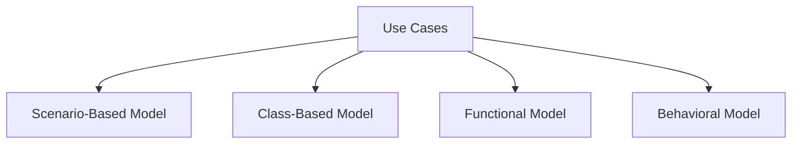
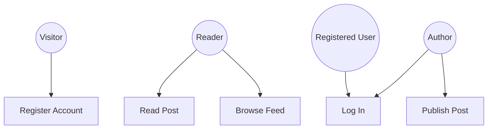
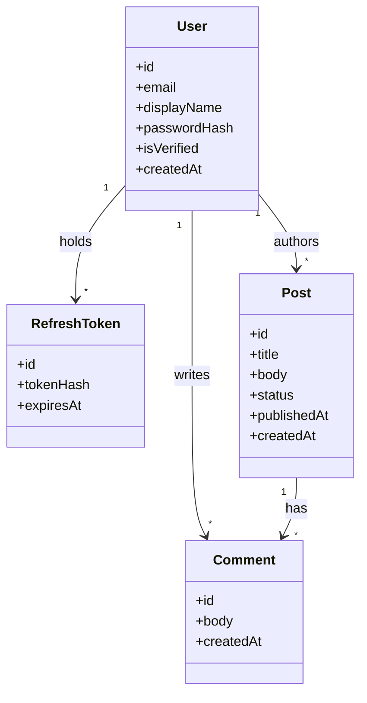
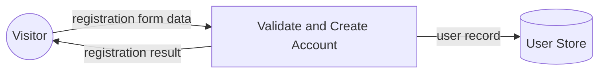
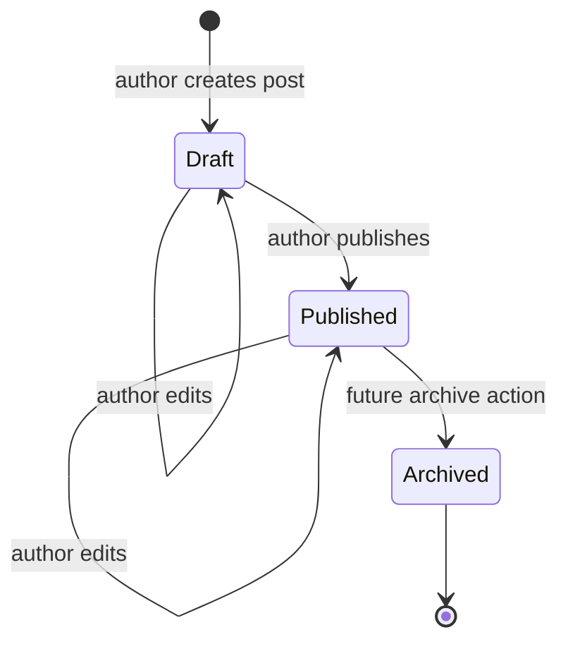

# Inkwell Analysis Model

## Model Overview

This diagram shows the four views used to analyze Inkwell's requirements.

---

## Scenario-Based Model

The use-case diagram shows which actors interact with the major Inkwell features.

---

## Class-Based Model

The domain model identifies the main data entities and their relationships.

---

## Functional Model

This data-flow diagram shows how registration information moves through the system.

---

## Behavioral Model

This state diagram shows the possible states and transitions for a post. Archiving is modeled as a future feature and is not part of the current US-03 MVP.

